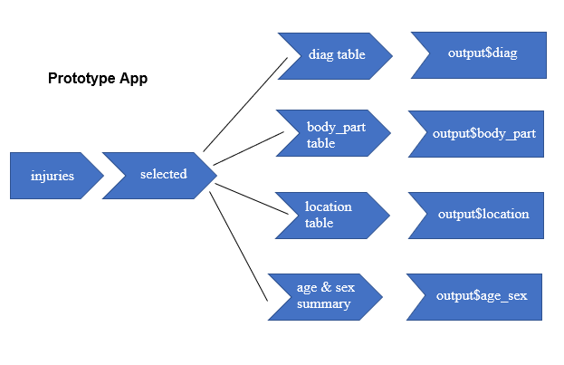
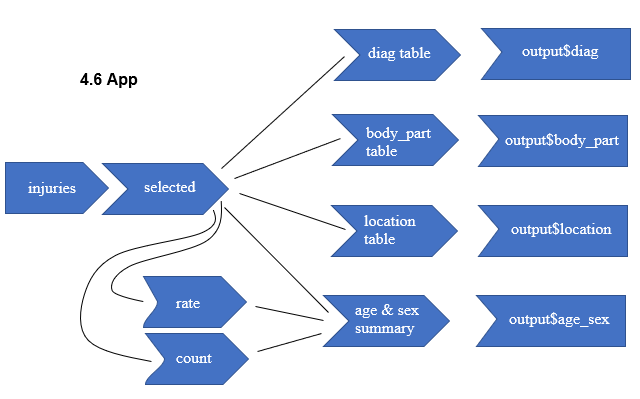

### Exercise 1

**Graph of 4.4**



**Graph of 4.5**


**Graph of 4.6**



**Graph of 4.7**


### Exercise 2

If you flip these two functions, the table produces errors because the code contains unused arguments.

### Exercise 3

I determined that the maximum amount of unique values in a given column is 30, so I am using that as max number of outputs. 

I changed the following pieces of code in the app.

Add a column in the UI for numeric input at the top:
```{r eval = FALSE}
column(2, numericInput("rows", "Number of Rows", value = 5, min = 0, max = 30))
```

Make the default n-value in `count_top()` function 30:
```{r eval = FALSE}
count_top <- function(df, var, n = 30) {
    df %>%
        mutate({{ var }} := fct_lump(fct_infreq({{ var }}), n = n)) %>%
        group_by({{ var }}) %>%
        summarise(n = as.integer(sum(weight)))
}
```

Use `head()` function in the server to reference the user input:
```{r eval = FALSE}
output$diag <- renderTable(head(count_top(selected(), diag), n = input$rows), width = "100%" )
    output$body_part <- renderTable(head(count_top(selected(), body_part), n = input$rows), width = "100%")
    output$location <- renderTable(head(count_top(selected(), location), n = input$rows), width = "100%")
```

### Exercise 4 

To move through the narrative, I had to create back/forward buttons and replace the `sample()` function from the output with `observeEvent` functions to calculate the index number of each narrative position.

Buttons added to the UI:
```{r eval = FALSE}
column(2, actionButton("back", "Previous")),
        column(2, actionButton("forward", "Next"))
```

Server code to display first narrative and move through the index according to which button clicked:
```{r eval = FALSE}
    n <- reactiveVal(1)
    
    observeEvent(input$back, {
        n(n() - 1)
    })
    observeEvent(input$forward, {
        n(n() + 1)
    })
                 
    output$narrative <- renderText(selected()$narrative[n()])
```

### Final App:

<iframe src= "https://hallc.shinyapps.io/masteringshiny_chap_4_exercises/" width = "900"; 
height = "900"; style = "border:none";></iframe>

- 